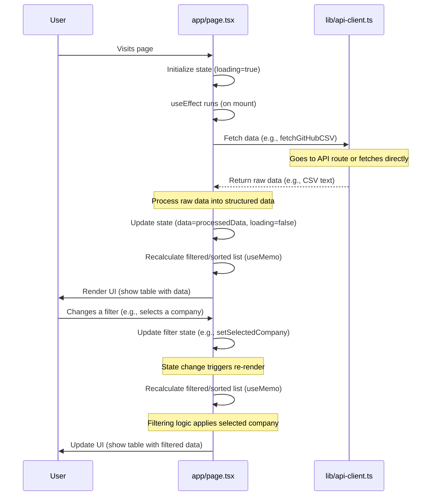

# Chapter 1: Main Application Page (`app/page.tsx`)

Welcome to the first chapter of the `test` project tutorial! We're starting at the very heart of the application: the main page. Think of this file, `app/page.tsx`, as the central control panel or the main dashboard of our application.

### What Problem Does it Solve?

Imagine you have a lot of data, like information about programming problems frequently asked in company interviews. You want to see this data, search through it, filter it (maybe only see problems from a specific company or of a certain difficulty), and sort it. You also want to see summaries and charts.

The problem is, how do you put all of this together on one screen? How does the screen know which data to show? How does it react when you type in a search box or click a filter?

The `app/page.tsx` file is where we solve this! Its main job is to:

1.  **Fetch the data** we need to display.
2.  **Keep track of everything** the user is doing (like what they searched for or which filter they selected).
3.  **Decide which parts of the page to show** and what data each part should get.
4.  **Handle user actions** (like clicking a button to refresh data).

In short, it's the conductor of our user interface orchestra, making sure all the different pieces work together.

Our central use case for this chapter is: **Displaying a list of programming problems and allowing users to filter and sort this list.**

Let's dive into how `app/page.tsx` makes this happen.

### What is `app/page.tsx`?

In this project, `app/page.tsx` is a special kind of file used in web development, specifically with a tool called Next.js and a way of building interfaces called React.

*   **It's a React Component:** This means it's like a building block for our web page. It's a piece of code that describes what a part of the user interface should look like and how it should behave.
*   **It's the Main Page:** Because it's named `page.tsx` inside the `app` directory (and specifically at the root `app/`), Next.js knows to show this component when someone visits the main address of our website (like `localhost:3000/`).
*   **`"use client"`:** At the very top, you'll see `"use client"`. This is a special instruction in Next.js that tells it this component needs to run in the user's web browser (on the "client" side), not just on the server. This is necessary because this page has a lot of user interaction (button clicks, typing) and manages state directly in the browser.

### Key Concepts

The `app/page.tsx` file manages a few core concepts to handle our use case:

1.  **State:** In web development, "state" is just a fancy word for data that can change over time and affects what the user sees. Our page needs to keep track of things like:
    *   Is the data currently loading?
    *   Did an error happen?
    *   What data did we successfully load?
    *   What text is in the search box?
    *   Which filter is selected (company, difficulty, etc.)?
    *   How should the list be sorted?
    `app/page.tsx` uses React's `useState` tool to manage these pieces of information.

    ```typescript
    // Inside app/page.tsx, at the top of the component function
    import { useState } from "react"; // Need to import useState

    // ... other imports

    export default function LeetCodeAnalytics() {
      // These are pieces of state
      const [data, setData] = useState<AnalyticsData | null>(null); // Holds the loaded data
      const [loading, setLoading] = useState(true); // True while data is loading
      const [error, setError] = useState<string | null>(null); // Holds an error message if something goes wrong

      // State for filters and sorting
      const [searchTerm, setSearchTerm] = useState(""); // Holds the text from the search box
      const [selectedCompany, setSelectedCompany] = useState("all"); // Holds the selected company filter
      // ... other filter states

      // ... rest of the component
    }
    ```
    This snippet shows how `useState` is used to declare variables (`data`, `loading`, `searchTerm`, etc.) and give them a starting value. `useState` provides a pair: the current value (e.g., `data`) and a function to update that value (e.g., `setData`). When you use the update function, React knows the state has changed and might need to re-render the page.

2.  **Data Fetching:** Before we can show problems, we need to get the data! This page is responsible for initiating that process. It calls a special helper ([API Client (`lib/api-client.ts`)](03_api_client___lib_api_client_ts___.md)) to get the data, typically when the page first loads.

    ```typescript
    // Inside app/page.tsx
    import { useEffect } from "react"; // Need to import useEffect
    import { apiClient } from "@/lib/api-client"; // Import our data fetching helper

    // ... other imports and state declarations

    export default function LeetCodeAnalytics() {
      // ... state declarations

      // This runs when the component first appears (mounts)
      useEffect(() => {
        const initializeData = async () => {
          try {
            setLoading(true); // Start loading indicator
            setError(null); // Clear any previous errors

            // Call the helper to get data (we'll learn about this in Chapter 3)
            const csvContent = await apiClient.fetchGitHubCSV();

            // Process the raw data (we'll learn about this in Chapter 5)
            const analyticsData = await csvProcessor.processCSVContent(csvContent);

            setData(analyticsData); // Store the processed data in state
            setSuccess("Data loaded!"); // Show a success message
            setLoading(false); // Hide loading indicator

          } catch (error) {
            console.error("Failed to load data", error);
            setError("Failed to load data."); // Show an error message
            setLoading(false); // Hide loading indicator
          }
        };

        initializeData(); // Run the function when the page loads
      }, []); // The empty array [] means this effect only runs once, on mount

      // ... rest of the component
    }
    ```
    The `useEffect` hook is used here to perform actions that happen *after* the component is first displayed or when certain values change. In this case, with `[]` as the second argument, it runs only once when the page loads. It calls an `async` function (`initializeData`) that handles the actual fetching and processing using `apiClient` and `csvProcessor`.

3.  **Handling User Input:** When a user types in the search bar or selects an option from a filter dropdown, the page needs to capture that input and update its state.

    ```typescript
    // Inside app/page.tsx
    // ... imports and state

    export default function LeetCodeAnalytics() {
      // ... state declarations

      // Function called when the search input changes
      const handleSearchChange = (event: React.ChangeEvent<HTMLInputElement>) => {
        setSearchTerm(event.target.value); // Update the searchTerm state
      };

      // Function called when the company filter changes
      const handleCompanyChange = (value: string) => {
         setSelectedCompany(value); // Update the selectedCompany state
      };

      // ... rest of the component

      // Inside the main return() part, where the UI is described
      return (
        <div>
          {/* ... header and other elements */}
          <input
            type="text"
            placeholder="Search..."
            value={searchTerm} // The input's value is controlled by state
            onChange={handleSearchChange} // When the value changes, call our handler
          />

          {/* ... filter panel component */}
          <FiltersPanel
             // ... other props
             selectedCompany={selectedCompany}
             onCompanyChange={handleCompanyChange} // Pass the handler to the filter component
             // ... other props
           />
          {/* ... rest of UI */}
        </div>
      );
    }
    ```
    Functions like `handleSearchChange` receive information about the user's action (like the input value) and use the state update functions (`setSearchTerm`, `setSelectedCompany`) to record the change. Components like the search input and filter panel are given the current state value (`searchTerm`, `selectedCompany`) and the update function (`handleSearchChange`, `handleCompanyChange`) as "props" (properties).

4.  **Rendering Components:** `app/page.tsx` doesn't draw everything itself. It uses other, smaller components for specific parts of the UI, like the list of problems (`<ProblemsTable>`) or the filters (`<FiltersPanel>`). The main page component decides *whether* to show these components (e.g., don't show the table if data is loading) and *what data or settings* to pass to them based on its state.

    ```typescript
    // Inside app/page.tsx
    // ... imports and state

    // Import the components it uses
    import { FiltersPanel } from "@/components/analytics/filters-panel";
    import { ProblemsTable } from "@/components/analytics/problems-table";
    import { LoadingSpinner } from "@/components/ui/loading-spinner";

    export default function LeetCodeAnalytics() {
       // ... state declarations
       const [loading, setLoading] = useState(true);
       const [data, setData] = useState<AnalyticsData | null>(null);
       // ... filter/sort states

       // ... useEffect for fetching

       // This calculates the list of problems to display based on current filters/sort
       const filteredAndSortedQuestions = useMemo(() => {
           if (!data) return [];
           // ... complex filtering and sorting logic based on searchTerm, selectedCompany, etc.
           return data.questions // simplified
              .filter(q => q.title.toLowerCase().includes(searchTerm.toLowerCase()))
              // ... apply other filters
              .sort((a, b) => /* ... apply sorting logic */ a.title.localeCompare(b.title)); // simplified
       }, [data, searchTerm, selectedCompany, /* ... other filter/sort dependencies */]); // Re-run when these change

       // ... rest of the component logic

       // Inside the main return() part, describing the UI
       if (loading) {
         return <LoadingSpinner text="Loading data..." />; // Show spinner if loading
       }

       if (!data) {
          return <div>No data loaded.</div> // Show a message if no data
       }

       return (
         <div>
           {/* ... header */}
           {/* Show the FiltersPanel, passing filter state and update handlers */}
           <FiltersPanel
             selectedCompany={selectedCompany}
             onCompanyChange={setSelectedCompany}
             // ... pass other filter props
             filteredCount={filteredAndSortedQuestions.length} // Pass count for display
             totalCount={data.questions.length}
           />

           {/* Show the ProblemsTable, passing the calculated list */}
           <ProblemsTable
             questions={filteredAndSortedQuestions}
             sortField={sortField}
             sortDirection={sortDirection}
             onSort={handleSort} // Pass the sorting handler
           />
           {/* ... other UI elements */}
         </div>
       );
    }
    ```
    The `return` part of the component describes the UI. It uses `if` statements to show different things based on `loading` or `data` state. It then renders other components like `FiltersPanel` and `ProblemsTable`, passing them the specific data and functions they need via props. The `useMemo` hook is crucial here: it efficiently recalculates the `filteredAndSortedQuestions` list *only* when the original `data` or any of the filter/sort state variables change. This prevents unnecessary recalculations and keeps the app fast.

### How it Solves the Use Case

Let's see how `app/page.tsx` ties these concepts together to display and manage our list of programming problems.

1.  **Initial Load:** When you first visit the page, `app/page.tsx` starts. The `loading` state is `true`. The `useEffect` hook runs, which calls the data fetching function (`initializeData`). This function will use the [API Client (`lib/api-client.ts`)](03_api_client___lib_api_client_ts___.md) to get the raw data and then the [CSV Data Processing](05_csv_data_processing_.md) logic to structure it.
2.  **Data Arrives:** Once the data is processed, `initializeData` calls `setData` and `setLoading(false)`. This updates the state, causing React to re-render the `app/page.tsx` component.
3.  **Initial Display:** Now that `loading` is `false` and `data` is not `null`, the component renders the main layout. The `useMemo` calculates the initial `filteredAndSortedQuestions` list (which is the full list since no filters are active yet). The `<FiltersPanel>` and `<ProblemsTable>` components are displayed, receiving the relevant data and state as props.
4.  **User Interaction (Filtering/Sorting):**
    *   A user types in the search box: The input's `onChange` calls the `handleSearchChange` function.
    *   `handleSearchChange` calls `setSearchTerm(newValue)`.
    *   Updating `searchTerm` causes `app/page.tsx` to re-render.
    *   Because `searchTerm` is listed as a dependency in the `useMemo` for `filteredAndSortedQuestions`, the `useMemo` function runs again.
    *   The filtering logic inside `useMemo` now includes the new `searchTerm`.
    *   A *new* list of `filteredAndSortedQuestions` is generated.
    *   The `<ProblemsTable>` component receives this *new* (and shorter) list as a prop.
    *   React efficiently updates only the part of the page showing the table with the new data.
    *   The same process happens when a user selects a filter or clicks a table header to sort – the relevant state (`selectedCompany`, `sortField`, `sortDirection`) is updated, triggering the `useMemo` and a re-render of the table with the updated list.

### Under the Hood: A Simplified Flow

Let's visualize the core flow of loading data and reacting to a simple filter change.



This diagram shows the initial data loading sequence and then the quick cycle that happens whenever a user interacts with a filter or sort control. The `app/page.tsx` component acts as the central point, managing state and triggering updates to the visible data.

### Conclusion

In this chapter, we explored `app/page.tsx`, the main component of our application. We learned that it acts as the control center, managing the application's state, initiating data fetches, handling user input, and deciding which components to render based on the current state. We saw how it uses React's `useState`, `useEffect`, and `useMemo` hooks to achieve this.

The data that `app/page.tsx` fetches and works with has a specific structure. In the next chapter, we will dive into understanding this structure.

[Chapter 2: Analytics Data Structure](02_analytics_data_structure_.md)

---

<sub><sup>Generated by [AI Codebase Knowledge Builder](https://github.com/The-Pocket/Tutorial-Codebase-Knowledge).</sup></sub> <sub><sup>**References**: [[1]](https://github.com/Ashraf8ila/test/blob/4147000cd966e2a3dee49acc2ef0020552f3c420/app/page.tsx)</sup></sub>