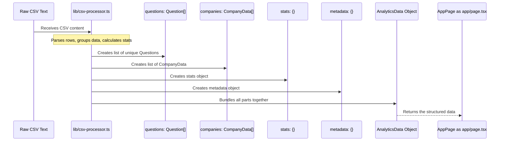

# Chapter 2: Analytics Data Structure

Welcome back! In the previous chapter ([Chapter 1: Main Application Page (`app/page.tsx`)](01_main_application_page___app_page_tsx___.md)), we saw how `app/page.tsx` acts as the conductor for our dashboard, fetching data, managing filters, and deciding what to show on screen. But what exactly *is* that data? How is it organized once it's fetched and processed?

That's what this chapter is all about: the **Analytics Data Structure**.

### What Problem Does it Solve?

Imagine you have a messy pile of raw data, like the information about programming problems asked by companies, maybe spread across many lines in a file. Before you can display this data in a nice table, create charts, or calculate summaries, you need to organize it. You need a clear blueprint that says: "Okay, here's the list of unique problems, here's a summary for each company, and here are some overall numbers."

The problem is, how do you define this blueprint so that all parts of your application (like the main page, the data processing logic, and the display components) agree on how the data looks?

The **Analytics Data Structure** solves this! It's like creating a standard format for our processed data. It ensures that when the data processing is finished, the result is always packaged in the same way. This makes it easy for `app/page.tsx` and the components it uses to know exactly what kind of information they will receive and where to find specific pieces of data (like the problem title or a company's stats).

Our central use case for this chapter is: **Understanding the organized format of the data that the main page uses to display problems, company stats, and overall metrics.**

### What is the Analytics Data Structure?

Think of the Analytics Data Structure as the **outline of a report** or the **schema of a simple database** tailored specifically for our application's needs. It's defined using TypeScript, which helps us clearly describe the shape of JavaScript objects.

In our project, this structure is primarily represented by a TypeScript type named `AnalyticsData`.

This `AnalyticsData` object contains everything the main page needs to display the dashboard. It typically has a few main sections:

*   A list of unique programming problems.
*   A list of summary statistics for each company.
*   Overall statistics and distributions (like how many easy, medium, hard problems).
*   Information about the data source itself (metadata).

Let's look at the main parts of this structure.

### Key Concepts of the Structure

The `AnalyticsData` type is the top-level container. Inside it, you'll find these key properties:

1.  **`questions`**: This is an array (a list) of `Question` objects.
2.  **`companies`**: This is an array (a list) of `CompanyData` objects.
3.  **`stats`**: This is an object containing various overall statistics.
4.  **`metadata`**: This is an object containing information about the data itself.

Here's a simplified look at the main `AnalyticsData` type:

```typescript
// Simplified representation of the main data structure
interface AnalyticsData {
  questions: Question[]; // A list of all unique problems
  companies: CompanyData[]; // A list of stats for each company
  stats: { /* ... overall numbers ... */ }; // Summary metrics
  metadata: { /* ... info about the data source ... */ }; // Data origin info
}

// (Question and CompanyData are defined elsewhere)
```

This tells us that any function returning `AnalyticsData` will give us an object with exactly these four main sections.

Now, let's look inside each section.

#### 1. The `Question` Type

This type defines what information is stored for *each unique programming problem*. Remember from the raw data that a single problem might appear multiple times (e.g., asked by Google and also by Facebook). The processing logic ([CSV Data Processing](05_csv_data_processing_.md)) combines these into a single `Question` entry.

Here's what a `Question` object typically contains:

```typescript
// Simplified structure for a single programming problem
interface Question {
  title: string; // The name of the problem (e.g., "Two Sum")
  difficulty: string; // Easy, Medium, or Hard
  link: string; // URL to the problem on LeetCode or similar
  frequency: number; // How frequently it appears (a score or %)
  acceptance_rate: number; // The percentage of successful submissions

  // IMPORTANT: Lists because one problem can be tagged with multiple
  companies: string[]; // List of companies that asked this problem
  timeframes: string[]; // List of timeframes it was reported in

  topics: string; // Topics covered (e.g., "Array, Hash Table")

  // ... potentially other internal fields
}
```

This structure is crucial for the `<ProblemsTable>` component we saw in Chapter 1. It iterates through the `questions` array and displays the `title`, `difficulty`, `link`, etc., for each item. It also allows filtering based on the `companies` and `timeframes` lists associated with each question.

#### 2. The `CompanyData` Type

This type defines what information is stored for *each unique company* found in the data. It provides a summary view per company.

Here's what a `CompanyData` object typically contains:

```typescript
// Simplified structure for company-specific statistics
interface CompanyData {
  name: string; // The name of the company (e.g., "Google")
  totalProblems: number; // Total unique problems associated with this company

  // Counts for problems seen in specific timeframes for this company
  thirtyDays: number;
  threeMonths: number;
  sixMonths: number;
  moreThanSixMonths: number;
  all: number; // Could overlap with totalProblems or mean something else
}
```

This structure is used by components that might display a list of companies with their problem counts, or perhaps visualize the timeframe distribution for problems asked by a specific company.

#### 3. The `stats` Object

This object holds various *aggregate* statistics calculated from the entire dataset. These are useful for summary panels, charts, or overall insights.

Here are some examples of what the `stats` object might contain:

```typescript
// Simplified structure for overall analytics statistics
interface OverallStats {
  totalProblems: number; // Total count of unique problems
  totalCompanies: number; // Total count of unique companies

  // How many problems per difficulty level (Easy, Medium, Hard)
  difficultyDistribution: Array<{ name: string; value: number; color: string }>;

  // How many problems were tagged with each timeframe across all companies
  timeframeDistribution: Array<{ name: string; value: number }>;

  // A list of the most common topics and how often they appear
  topTopics: Array<{ name: string; count: number }>;
}
```

Components displaying charts (like difficulty breakdown pie charts) or summary cards (like "Total Problems: 500") would read directly from this `stats` object within the `AnalyticsData`.

#### 4. The `metadata` Object

This object holds information *about the data itself*, rather than the content of the data. It provides context about where the data came from and when it was processed.

Here are some examples of what the `metadata` object might contain:

```typescript
// Simplified structure for data source metadata
interface DataMetadata {
  lastUpdated: string; // Timestamp when the data was processed
  cloneDate: string; // Timestamp when the source file was obtained

  // Info about the specific version of the source data (e.g., from Git commit)
  lastCommitHash: string;
  commitUrl: string;
  commitMessage: string;
  commitAuthor: string;
}
```

This metadata can be displayed in a footer or an "About Data" section of the dashboard to provide transparency and traceability.

### How it Solves the Use Case

The `AnalyticsData` structure directly supports our use case of displaying problems, company stats, and overall metrics on the main page.

When `app/page.tsx` successfully fetches and processes the data, it stores the resulting `AnalyticsData` object in its state (remember the `setData(analyticsData)` call from Chapter 1?).

```typescript
// From app/page.tsx (simplified)
const [data, setData] = useState<AnalyticsData | null>(null);

// ... inside useEffect after processing ...
setData(processedAnalyticsData);

// ... later in the render function ...
if (data) {
  // We can now access all parts of the structure easily
  const problemsList = data.questions; // Get the list of problems
  const companySummaries = data.companies; // Get the company stats
  const overallStats = data.stats; // Get the overall numbers

  // Pass the relevant parts to child components
  // <ProblemsTable questions={problemsList} ... />
  // <CompanyStatsList companies={companySummaries} ... />
  // <StatsPanel stats={overallStats} ... />
}
```

Because the `AnalyticsData` structure is well-defined and consistent, `app/page.tsx` knows exactly how to extract the specific lists or objects needed by the different UI components and pass them down as props.

### Under the Hood: Structure Creation

Where does this `AnalyticsData` object come from? It's the final output of the data processing logic, which we'll cover in detail in [Chapter 5: CSV Data Processing](05_csv_data_processing_.md).

Essentially, the process looks like this:

1.  Raw data (like CSV text) is obtained ([API Client (`lib/api-client.ts`)](03_api_client___lib_api_client_ts___.md)).
2.  A processing function (in `lib/csv-processor.ts`) takes the raw data.
3.  It parses the raw data line by line.
4.  It groups related data (like multiple rows for the same problem) to create the list of unique `Question` objects.
5.  It calculates summaries to create the `CompanyData` objects.
6.  It counts and aggregates data to create the `stats` object.
7.  It gathers information about the source to create the `metadata`.
8.  Finally, it bundles all these pieces together into a single `AnalyticsData` object.

Here's a simplified look at this creation flow:



The actual code that defines these structures lives primarily in files responsible for processing data or handling API responses, ensuring consistency. You can find these definitions, for example, in `lib/csv-processor.ts` and `app/api/process-csv/route.ts`. They look very similar because they need to agree on the format.

Here are small snippets showing where these types are defined (you don't need to understand every line yet!):

```typescript
// From lib/csv-processor.ts or app/api/process-csv/route.ts

// Defines the structure for a single problem
export interface Question {
  difficulty: string;
  title: string;
  // ... other fields like frequency, acceptance_rate, link
  companies: string[]; // Array of strings
  timeframes: string[]; // Array of strings
  topics: string;
  // ... potentially originalRows: CSVRow[] (used internally)
}

// Defines the structure for company stats
export interface CompanyData {
  name: string;
  totalProblems: number;
  thirtyDays: number;
  // ... other timeframe counts
}

// Defines the overall structure returned
export interface AnalyticsData {
  questions: Question[];
  companies: CompanyData[];
  stats: { /* ... detailed stats definition ... */ };
  metadata: { /* ... detailed metadata definition ... */ };
}
```

These `interface` declarations in TypeScript are the blueprints. They tell developers and tools exactly what properties an object of that type should have and what type of data (string, number, array) each property holds. This is incredibly helpful for preventing errors and understanding the code.

### Conclusion

In this chapter, we've demystified the **Analytics Data Structure**. We learned that it's the organized blueprint for the processed data in our application, containing lists of `Question` objects, `CompanyData` summaries, overall `stats`, and `metadata`. Understanding this structure is key because it dictates how data is stored, accessed, and displayed throughout the dashboard, particularly by `app/page.tsx` and its child components.

Now that we know *what* the data looks like when it's ready, let's explore *how* `app/page.tsx` gets this data in the first place. In the next chapter, we'll look at the API Client.

[Chapter 3: API Client (`lib/api-client.ts`)](03_api_client___lib_api_client_ts___.md)

---

<sub><sup>Generated by [AI Codebase Knowledge Builder](https://github.com/The-Pocket/Tutorial-Codebase-Knowledge).</sup></sub> <sub><sup>**References**: [[1]](https://github.com/Ashraf8ila/test/blob/4147000cd966e2a3dee49acc2ef0020552f3c420/app/api/process-csv/route.ts), [[2]](https://github.com/Ashraf8ila/test/blob/4147000cd966e2a3dee49acc2ef0020552f3c420/lib/csv-processor.ts)</sup></sub>