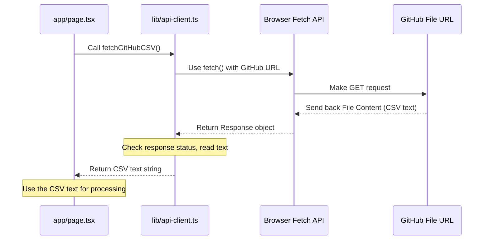

# Chapter 3: API Client (`lib/api-client.ts`)

Welcome back, aspiring developer! In our last chapter ([Chapter 2: Analytics Data Structure](02_analytics_data_structure_.md)), we explored the organized format of the data our application uses to display information. We learned *what* the data looks like once it's ready.

Now, the big question is: How does the main application page ([Chapter 1: Main Application Page (`app/page.tsx`)](01_main_application_page___app_page_tsx___.md)) actually *get* this data in the first place? It needs to reach out to somewhere – either a backend service or an external source – to retrieve the raw information.

That's where the **API Client** comes in!

### What Problem Does it Solve?

Imagine you're ordering food from a restaurant. You don't go into the kitchen yourself to grab the ingredients and cook. You talk to a waiter, tell them what you want, and they handle the communication with the kitchen.

In a web application, the "kitchen" is where the data is (a database, an external file, a backend server). The "main page" is like you, the customer, who needs the food (data). If every part of your main page or every button click had to figure out *how* to talk to the kitchen (the data source) directly, your code would get very messy, very fast. You'd have `fetch` calls scattered everywhere, dealing with URLs, request methods (`GET`, `POST`), headers, and error checks in multiple places.

The problem is: **How do we centralize and simplify the process of requesting data from backend services or external sources?**

The **API Client** (`lib/api-client.ts`) solves this! It acts like our dedicated **waiter** or **messenger service**. Instead of components making direct requests, they simply tell the `apiClient` what data they need, and the `apiClient` handles the complex task of talking to the data source. This keeps the main page and other UI components focused on displaying information and handling user interaction, not worrying about the details of network communication.

Our central use case for this chapter is: **Fetching the raw CSV data file content from a specific GitHub URL.**

### What is the API Client?

In this project, `lib/api-client.ts` contains the code for our API Client. It's essentially a JavaScript class with methods (functions) that represent different requests we can make to get data.

*   **Centralized Requests:** All outgoing data requests from the frontend go through this one place.
*   **Abstraction:** It hides the low-level details of making network requests (like using the `fetch` API).
*   **Basic Handling:** It can include basic logic for handling common scenarios, like checking if a response was successful or basic error reporting (though detailed error handling is in a later chapter).

You can think of it as a command center for all outgoing data missions from the frontend.

### Key Concepts & How to Use

The main way `app/page.tsx` (and potentially other parts of the frontend) interacts with the API Client is by calling its methods.

1.  **The `apiClient` Instance:** There's typically a single instance (a specific object created from the class) of the `ApiClient` that is used throughout the application.

    ```typescript
    // Inside lib/api-client.ts (at the bottom)
    // This creates one instance of the ApiClient class
    export const apiClient = new ApiClient();

    // Inside app/page.tsx (at the top)
    import { apiClient } from "@/lib/api-client"; // Import the instance
    ```
    This `export const apiClient = new ApiClient();` line makes the single messenger instance available to any other file that imports it. The `app/page.tsx` file imports this instance to use it.

2.  **Making a Data Request:** The main page needs the raw CSV data from GitHub. The `apiClient` provides a specific method for this: `fetchGitHubCSV()`.

    ```typescript
    // Inside app/page.tsx (simplified)
    import { useEffect } from "react";
    import { apiClient } from "@/lib/api-client"; // Import our messenger

    // ... state declarations ...

    export default function LeetCodeAnalytics() {
      // ... state declarations ...

      useEffect(() => {
        const initializeData = async () => {
          try {
            // Tell the apiClient messenger: "Go get the GitHub CSV data!"
            const csvContent = await apiClient.fetchGitHubCSV();

            // The apiClient handles the network request and returns the data.
            // Now, the main page can use this data (e.g., process it)
            console.log("Successfully fetched CSV content:", csvContent.substring(0, 100) + '...'); // Log start of content

            // ... then process this csvContent (as seen in Chapter 1)
            // const analyticsData = await csvProcessor.processCSVContent(csvContent);
            // setData(analyticsData);
            // ... update loading/success state ...

          } catch (error) {
            // If the apiClient reports an error, handle it here
            console.error("Failed to fetch CSV data:", error);
            // ... update error state ...
          }
        };

        initializeData(); // Run this when the page loads
      }, []); // Empty array means run only once on mount

      // ... rest of the component ...
    }
    ```
    In this simplified example, `useEffect` runs once when the page loads. Inside it, `apiClient.fetchGitHubCSV()` is called. This is the main page asking the API Client messenger to perform the specific task of fetching the GitHub CSV. It uses `await` because fetching data over a network takes time; the code waits here until the `apiClient` finishes its task and returns the result. The result is the raw text content of the CSV file.

3.  **Handling Different Requests:** While `fetchGitHubCSV` is key for our use case, the `ApiClient` class can have other methods for different kinds of requests. For example, the original project idea included uploading a file, which might involve a `POST` request to our own backend API:

    ```typescript
    // Inside lib/api-client.ts (simplified method example)
    async processCSV(formData: FormData): Promise<any> {
      // This method sends data to our own backend API route
      const response = await fetch(`${this.baseUrl}/api/process-csv`, {
        method: "POST",
        body: formData, // The data to send
      });
      // ... handle response ...
    }

    // Inside app/page.tsx (how you might use another method)
    // async function handleFileUpload(file: File) {
    //   const formData = new FormData();
    //   formData.append('csvFile', file);
    //   const result = await apiClient.processCSV(formData); // Call the other method
    //   // ... handle result ...
    // }
    ```
    This shows that the `apiClient` can encapsulate various ways of getting or sending data, keeping the calling code clean. For *this chapter's use case*, we focus on `fetchGitHubCSV`.

### How it Solves the Use Case

The API Client directly solves the use case of fetching the raw CSV data by providing the `fetchGitHubCSV()` method.

1.  The main page ([Chapter 1: Main Application Page (`app/page.tsx`)](01_main_application_page___app_page_tsx___.md)) needs the data.
2.  Instead of writing `fetch('https://...')` directly in `app/page.tsx`, it calls `apiClient.fetchGitHubCSV()`.
3.  The `apiClient` knows the specific URL and details needed to fetch the file.
4.  It performs the network request.
5.  It receives the response.
6.  It checks if the response was successful.
7.  It extracts the raw CSV text from the response.
8.  It returns this raw text string back to the main page.
9.  The main page can then pass this raw text to the data processing logic ([Chapter 5: CSV Data Processing](05_csv_data_processing_.md)).

This single, clear method call (`apiClient.fetchGitHubCSV()`) in `app/page.tsx` replaces several lines of network code and keeps the page component cleaner.

### Under the Hood: What the Messenger Does

Let's peek inside the `apiClient` to see how `fetchGitHubCSV()` works its magic.

First, a simple walkthrough:

1.  When `apiClient.fetchGitHubCSV()` is called, the `apiClient` object prepares for the network request.
2.  It knows the target URL for the GitHub CSV file.
3.  It uses the built-in browser `fetch` function to make a `GET` request to that specific URL.
4.  The browser sends the request over the internet to GitHub's servers.
5.  GitHub's servers find the file and send its content back as a response.
6.  The `apiClient` receives this response.
7.  It immediately checks if the response was successful (status code like 200 OK). If not, it knows something went wrong and prepares an error.
8.  If successful, it reads the body of the response specifically as plain text.
9.  Once the text is read, it returns that text string back to the code that called it (the `app/page.tsx` component's `useEffect` function).
10. If any step failed (network issue, file not found), it creates an error object and throws it, which the calling code needs to catch.

Here's a sequence diagram showing this simple flow:



Now, let's look at the actual (simplified) code inside `lib/api-client.ts`:

```typescript
// Inside lib/api-client.ts (simplified)
// Import error handling helpers
import { NetworkError, handleError } from "./error-handler"
import { logger } from "./logger" // Also imports logging

class ApiClient {
  // ... constructor and other methods ...

  async fetchGitHubCSV(): Promise<string> {
    try {
      logger.info("Fetching CSV data from GitHub"); // Log the action

      // Use the browser's built-in fetch function
      const response = await fetch(
        "https://raw.githubusercontent.com/AlliterationofA/PublicFiles/main/codedata.csv",
      );

      // Check if the HTTP response was successful (status 200-299)
      if (!response.ok) {
        logger.error("HTTP Error fetching GitHub CSV", { status: response.status });
        // Create and throw a specific error if not successful
        throw new NetworkError(`Failed to fetch GitHub CSV: HTTP ${response.status}`);
      }

      // Read the response body as plain text
      const csvContent = await response.text();

      logger.info("GitHub CSV data fetched successfully", { size: csvContent.length });

      // Return the raw text content
      return csvContent;

    } catch (error) {
      // If any error occurred (network, response check, etc.)
      // Use a helper to process the error (more in Chapter 8)
      const appError = handleError(error, "GitHub CSV Fetch");
      logger.error("Failed to fetch GitHub CSV", appError);
      // Re-throw the handled error so the caller (app/page.tsx) can catch it
      throw appError;
    }
  }
}

// This is the single instance used throughout the app
export const apiClient = new ApiClient();
```

This code snippet shows the core logic of `fetchGitHubCSV`:

1.  It calls `fetch()` with the hardcoded URL of the raw CSV file on GitHub. The `await` keyword pauses execution until the network request is complete.
2.  It checks `!response.ok`. The `.ok` property is a simple way to see if the HTTP status code indicates success (usually 200-299).
3.  If `!response.ok` is true, it means there was an error (like 404 Not Found, 500 Server Error). It throws a `NetworkError` with details.
4.  If the response *is* ok, it calls `response.text()` using `await` to read the entire body of the response as a single string.
5.  Finally, it returns this `csvContent` string.
6.  The `try...catch` block wraps the network request. If anything inside `try` fails (like a network connection error before even getting a response, or the `NetworkError` being thrown), the code in the `catch` block runs.
7.  The `handleError` and `logger` calls are part of the application's error handling and logging strategy, which we'll explore in later chapters ([Chapter 8: Error Handling (`lib/error-handler.ts`)](08_error_handling___lib_error_handler_ts___.md)). They ensure errors are reported consistently before being re-thrown.

By putting this logic inside `apiClient.fetchGitHubCSV()`, the `app/page.tsx` component only needs to know *that* this method exists and *what* it returns (a Promise that resolves to a string or rejects with an error), without needing to worry about the URL, the fetch options, or parsing the response text.

### Conclusion

In this chapter, we introduced the **API Client** (`lib/api-client.ts`). We learned that it acts as a centralized messenger service for the frontend, handling all network requests to backend APIs or external sources. This abstraction keeps our UI components clean and focused on presentation. We saw how `app/page.tsx` uses the `apiClient.fetchGitHubCSV()` method to retrieve the raw data needed for the application, and we got a peek under the hood to see how this method uses the browser's `fetch` API to perform the actual request and handle basic response checking.

Now that we understand how the frontend *requests* data via the API Client, what about the other side? How does our application provide data via its *own* API endpoints? That's the topic of our next chapter!

[Chapter 4: API Route Handlers (`app/api/...`)](04_api_route_handlers___app_api_______.md)

---

<sub><sup>Generated by [AI Codebase Knowledge Builder](https://github.com/The-Pocket/Tutorial-Codebase-Knowledge).</sup></sub> <sub><sup>**References**: [[1]](https://github.com/Ashraf8ila/test/blob/4147000cd966e2a3dee49acc2ef0020552f3c420/app/page.tsx), [[2]](https://github.com/Ashraf8ila/test/blob/4147000cd966e2a3dee49acc2ef0020552f3c420/lib/api-client.ts)</sup></sub>