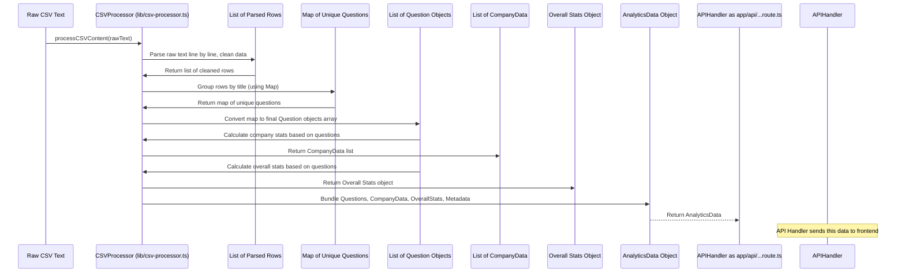

# Chapter 5: CSV Data Processing

Welcome back! In the previous chapter ([Chapter 4: API Route Handlers (`app/api/...`)](04_api_route_handlers___app_api_______.md)), we saw how our server-side API Route Handler (`app/api/process-csv/route.ts`) receives the raw CSV data, either from an upload or by fetching a default file. But getting the raw text is just the first step. That raw text is like a pile of ingredients. Before our frontend ([Chapter 1: Main Application Page (`app/page.tsx`)](01_main_application_page___app_page_tsx___.md)) can display a useful dashboard, search, filter, and sort, that raw text needs to be cleaned, organized, and summarized.

### What Problem Does it Solve?

Imagine you have a spreadsheet (like a CSV file) listing programming problems, and each row includes details like the problem title, difficulty, which company asked it, and when.

*   The *same problem* might appear on multiple rows if different companies asked it or if it was reported in different timeframes.
*   Data might be messy: extra spaces, missing values, numbers stored as text.
*   You need to know things like the total number of *unique* problems, how many problems are Easy, Medium, or Hard, and how many problems each *company* is associated with, grouped together.

The problem is: **How do you take the raw, line-by-line data from a CSV and transform it into a structured, usable format that summarizes and organizes the information, ready for display and interaction?**

**CSV Data Processing** solves this! It's the "data factory" part of our application. Its job is to take that raw CSV text, read it row by row, clean it up, figure out which rows belong to the same unique problem, combine related information, and calculate summary statistics. The output of this factory is the clean, organized data structure we learned about in [Chapter 2: Analytics Data Structure](02_analytics_data_structure_.md), ready to be sent back to the frontend.

Our central use case for this chapter is: **Taking the raw CSV text received by the API Route Handler and converting it into the structured `AnalyticsData` object.**

### What is CSV Data Processing?

In our project, the core logic for CSV Data Processing lives primarily in a separate file, `lib/csv-processor.ts`. This file defines a class, `CSVProcessor`, which contains methods (functions) specifically designed to handle the steps involved in transforming the raw CSV string into the `AnalyticsData` structure.

*   **Encapsulation:** All the complex parsing, cleaning, grouping, and calculation logic is kept together in this one place (`lib/csv-processor.ts`), making it easier to manage and test.
*   **Used by the API Route:** The API Route Handler ([Chapter 4: API Route Handlers (`app/api/...`)](04_api_route_handlers___app_api_______.md)) is the main consumer of this processing logic. It calls the `CSVProcessor`'s methods after it has obtained the raw CSV content.
*   **Outputs Structured Data:** The main output is the `AnalyticsData` object, conforming to the types defined in [Chapter 2: Analytics Data Structure](02_analytics_data_structure_.md).

Think of `lib/csv-processor.ts` as containing the "recipes" and "machinery" for turning raw data ingredients into a ready-to-serve meal.

### Key Concepts

The process of converting raw CSV text to `AnalyticsData` involves several steps. The `CSVProcessor` class bundles methods for each of these steps:

1.  **Reading Lines and Headers:** The first step is to split the raw text into individual lines and identify the header row to understand what each column represents.
    ```typescript
    // Simplified - happens inside processCSVContent
    const lines = csvContent.trim().split("\n");
    const headerLine = lines[0];
    const headers = headerLine.split(",").map(h => h.trim()); // Basic split by comma

    // lines[1], lines[2], etc., are the data rows
    ```
    This uses basic string manipulation to get the lines and headers. (The actual code includes more robust logic, like handling commas *within* quoted fields, in the `parseCSVRow` method).

2.  **Parsing Individual Rows:** Each data line needs to be broken down into its individual values, matching them to the headers. This is also where basic cleaning and type conversion happen.
    ```typescript
    // Simplified - happens inside the loop in processCSVContent
    // Imagine processing a single data line like: "Easy,Two Sum,50,0.45,link,Google,1 Month,Array"
    const values = parseCSVRow(dataLine); // Uses a dedicated helper function

    const row = {
      difficulty: values[headers.indexOf("difficulty")] || "Medium", // Handle missing difficulty
      title: values[headers.indexOf("title")] || "Unknown Problem",
      frequency: parseFrequency(values[headers.indexOf("frequency")]), // Convert to number
      acceptance_rate: parseAcceptanceRate(values[headers.indexOf("acceptance_rate")]), // Convert to number/percentage
      link: values[headers.indexOf("link")],
      company: values[headers.indexOf("company")],
      timeframe: values[headers.indexOf("timeframe")],
      topics: values[headers.indexOf("topics")],
    };
    // Store this parsed row, maybe after basic validation
    ```
    The `parseCSVRow` function (shown later) is a helper to handle the complexity of splitting by comma while respecting quotes. After getting the values, the code creates a structured object for that row, performing basic cleanup like providing default values or converting strings to numbers using dedicated helper methods like `parseFrequency` and `parseAcceptanceRate`.

3.  **Grouping Questions:** This is a crucial step. The raw data might have multiple rows for "Two Sum" (e.g., one for Google 1 Month, one for Facebook 3 Months). We want a single entry for "Two Sum" in our final `questions` list, but it needs to remember *all* the companies and timeframes associated with it.
    ```typescript
    // Simplified - happens in the loop building questionsMap
    const questionsMap = new Map<string, any>(); // Use a Map to group by title

    for (const row of csvRows) { // Iterate through all parsed rows
      const title = row.title;

      if (!questionsMap.has(title)) {
        // First time seeing this problem title
        questionsMap.set(title, {
          data: { /* basic problem info from this row */ title, difficulty: row.difficulty, ... },
          companies: new Set<string>(), // Use Sets to store unique companies
          timeframes: new Set<string>(), // Use Sets for unique timeframes
          originalRows: [] // Keep original rows if needed later
        });
      }

      // Add company and timeframe from the current row to the existing entry
      const questionEntry = questionsMap.get(title);
      questionEntry.companies.add(row.company);
      questionEntry.timeframes.add(row.timeframe);
      questionEntry.originalRows.push(row);
    }

    // After the loop, convert the map values into the final array of Question objects
    const questions = Array.from(questionsMap.values()).map(entry => ({
       ...entry.data,
       companies: Array.from(entry.companies).sort(), // Convert Sets to sorted Arrays
       timeframes: Array.from(entry.timeframes).sort(),
       originalRows: entry.originalRows
       // Add default company/timeframe from one of the entries if needed for compatibility
       company: entry.companies.values().next().value, // Take the first company
       timeframe: entry.timeframes.values().next().value, // Take the first timeframe
    }));
    ```
    This snippet shows using a `Map` where the *key* is the problem title. As we process each raw row, we check if we've already started an entry for that title. If not, we create one. If yes, we just add the `company` and `timeframe` from the current row to `Set`s associated with that entry. Sets are useful because they automatically handle duplicates. Finally, we convert the map entries into the desired `Question` array format.

4.  **Calculating Company Statistics:** Once we have the list of unique `Question` objects (each with a list of associated companies), we can iterate through them to count problems per company and per timeframe category (1 Month, 3 Months, etc.).
    ```typescript
    // Simplified - happens in calculateCompanyStats method
    const companiesMap = new Map<string, CompanyData>();

    for (const question of questions) { // Iterate through the unique questions
      for (const companyName of question.companies) { // For each company associated with this question
        if (!companiesMap.has(companyName)) {
          // First time seeing this company
          companiesMap.set(companyName, {
            name: companyName,
            totalProblems: 0,
            thirtyDays: 0, // Initialize all counts to 0
            threeMonths: 0,
            sixMonths: 0,
            moreThanSixMonths: 0,
            all: 0,
          });
        }
        const companyData = companiesMap.get(companyName);
        companyData.totalProblems += 1; // Increment total for this company

        // Now count timeframes for this company based on this question
        for (const timeframe of question.timeframes) {
           const timeframeLower = timeframe.toLowerCase();
           if (timeframeLower.includes("1 month") || timeframeLower.includes("thirty")) {
             companyData.thirtyDays += 1;
           } // ... similar checks for 3 month, 6 month, etc.
        }
      }
    }
    const companies = Array.from(companiesMap.values()).sort(...); // Convert Map values to sorted array
    ```
    This logic iterates through the *grouped* questions and their `companies` list. For each company, it creates or updates an entry in the `companiesMap`, incrementing counters based on the question's properties (like `timeframes`).

5.  **Calculating Overall Statistics:** Similarly, we iterate through the unique questions and calculate total counts for things like difficulty distribution, timeframe distribution, and common topics.
    ```typescript
    // Simplified - happens in calculateStats method
    const difficultyCount = new Map<string, number>();
    const topicCount = new Map<string, number>();

    for (const question of questions) { // Iterate through the unique questions
      // Count difficulty
      const difficulty = question.difficulty || "Unknown";
      difficultyCount.set(difficulty, (difficultyCount.get(difficulty) || 0) + 1);

      // Count topics (splitting the topics string)
      if (question.topics) {
        const topics = question.topics.split(/[;,|]/).map(t => t.trim()).filter(t => t);
        for (const topic of topics) {
           topicCount.set(topic, (topicCount.get(topic) || 0) + 1);
        }
      }
      // ... similar logic for timeframe distribution ...
    }

    const difficultyDistribution = Array.from(difficultyCount.entries()).map(([name, value]) => ({ name, value, color: '...' }));
    const topTopics = Array.from(topicCount.entries()).sort(...).slice(0, 20); // Get top 20
    // ... combine results into the stats object structure
    ```
    This iterates through the processed questions and aggregates counts based on properties like `difficulty` and `topics`, creating the data needed for charts and summary panels.

### How it Solves the Use Case

The `CSVProcessor`'s main method, `processCSVContent`, is designed specifically to solve the use case of converting raw CSV text into `AnalyticsData`.

1.  The API Route Handler ([Chapter 4: API Route Handlers (`app/api/...`)](04_api_route_handlers___app_api_______.md)) receives the raw CSV content (as a string).
2.  Inside the API Route Handler, it calls `await csvProcessor.processCSVContent(csvContent);`.
3.  The `processCSVContent` method executes all the key concepts described above: it parses rows, validates data, groups identical problems, calculates company stats, calculates overall stats, and gathers metadata.
4.  It packages the results of these steps into a single `AnalyticsData` object.
5.  The `processCSVContent` method returns this `AnalyticsData` object.
6.  The API Route Handler receives the structured `AnalyticsData` and includes it in the JSON response sent back to the frontend.
7.  The frontend ([Chapter 1: Main Application Page (`app/page.tsx`)](01_main_application_page___app_page_tsx___.md)) receives this `AnalyticsData` object via the API Client and can immediately use it to populate the table, filters, and statistics panels because it matches the expected structure ([Chapter 2: Analytics Data Structure](02_analytics_data_structure_.md)).

This modular design keeps the complex processing logic separate from the API route concerns (receiving requests, sending responses) and the frontend concerns (displaying data, handling UI state).

### Under the Hood: The Processing Flow

Let's visualize the steps the `CSVProcessor` takes when its `processCSVContent` method is called.



This diagram shows the transformation pipeline. The raw text is progressively processed, grouped, and summarized through several internal steps within the `CSVProcessor` until the final structured `AnalyticsData` object is assembled.

Now, let's look at a simplified overview of the `CSVProcessor` class and its main method in `lib/csv-processor.ts`.

```typescript
// Inside lib/csv-processor.ts (Simplified)
import { logger } from "./logger"; // For logging messages
import { ValidationError, DataProcessingError, handleError } from "./error-handler"; // For handling errors
// Import the data structure interfaces from Chapter 2 or related file
// import { AnalyticsData, Question, CompanyData } from "./data-structures";

// Define helper interfaces (matching Chapter 2's structures)
interface CSVRow { /* ... simplified structure for one raw row ... */ }
interface Question { /* ... structure for one unique problem ... */ }
interface CompanyData { /* ... structure for company stats ... */ }
interface AnalyticsData { /* ... top-level structure ... */ }


class CSVProcessor {
  // Helper method for parsing a single complex CSV row (handles quotes)
  private parseCSVRow(row: string): string[] {
      // ... complex logic to split row by comma, respecting quotes ...
      return ["value1", "value2", "value3", ...]; // Return array of values
  }

  // Helper to parse frequency string into a number
  private parseFrequency(frequencyStr: string): number {
      // ... logic to extract number from string like "50%" ...
      return 50.0; // Return a number
  }

   // Helper to parse acceptance rate string/number into a percentage number
  private parseAcceptanceRate(acceptanceRate: any): number {
       // ... logic to convert to percentage, handle numbers/strings ...
       return 50.0; // Return a number
  }

  // Helper method to calculate CompanyData[] from Question[]
  private calculateCompanyStats(questions: Question[]): CompanyData[] {
      // ... logic from step 4 (iterating questions, grouping by company, counting timeframes) ...
      return [/* ... array of CompanyData objects ... */];
  }

  // Helper method to calculate the stats object from Question[]
  private calculateStats(questions: Question[]) {
     // ... logic from step 5 (counting difficulty, topics, etc.) ...
     return { /* ... stats object ... */ };
  }

  // --- The main method called by the API route handler ---
  async processCSVContent(csvContent: string): Promise<AnalyticsData> {
    try {
      logger.info("Starting CSV content processing");

      // 1. Read lines & headers
      const lines = csvContent.trim().split("\n");
      // ... validation (check for empty file, headers) ...
      const headers = lines[0].split(",").map(h => h.trim()); // Simplified header parse

      // 2. Parse all CSV rows into initial objects (using parseCSVRow helper)
      const csvRows: CSVRow[] = [];
      for (let i = 1; i < lines.length; i++) {
         const values = this.parseCSVRow(lines[i]);
         // ... map values to headers, basic cleanup, validation ...
         csvRows.push(/* ... created CSVRow object ... */);
      }
      logger.info(`Parsed ${csvRows.length} data rows`);

      // 3. Group rows by title to create unique Question objects (using Map)
      const questionsMap = new Map<string, any>();
      for (const row of csvRows) {
         // ... logic to add to questionsMap, collecting companies/timeframes in Sets ...
      }
      // Convert map to final Question[] array
      const questions: Question[] = Array.from(questionsMap.values()).map(/* ... transformation ... */);
      logger.info(`Deduplicated to ${questions.length} unique questions`);


      // 4. Calculate Company Statistics
      const companies = this.calculateCompanyStats(questions);
      logger.info(`Calculated stats for ${companies.length} companies`);

      // 5. Calculate Overall Statistics
      const stats = this.calculateStats(questions);
      // ... potentially fetch metadata (like GitHub commit info) ...
      const metadata = { /* ... metadata object ... */ }; // Placeholder

      // Bundle everything into the final AnalyticsData object
      const analyticsData: AnalyticsData = {
        questions,
        companies,
        stats,
        metadata,
      };

      logger.info("CSV processing completed successfully");
      return analyticsData;

    } catch (error) {
      // Handle any errors during processing
      const appError = handleError(error, "CSV Processing");
      logger.error("CSV processing failed", appError);
      throw appError; // Re-throw the error for the caller (API route)
    }
  }
}

// Create and export a single instance to be used elsewhere
export const csvProcessor = new CSVProcessor();
```

This simplified code shows the overall structure of the `CSVProcessor` class and the steps within the `processCSVContent` method. It relies on smaller, private helper methods (`parseCSVRow`, `calculateCompanyStats`, `calculateStats`, etc.) to keep the main method clean and readable. The use of `try...catch` blocks and logging (`logger.info`, `logger.error`) and error handling helpers (`handleError`) is important for understanding where problems occurred, which is a topic covered in [Chapter 8: Error Handling (`lib/error-handler.ts`)](08_error_handling___lib_error_handler_ts___.md). The result of `processCSVContent` is always the complete `AnalyticsData` object, or an error is thrown.

### Conclusion

In this chapter, we explored the vital concept of **CSV Data Processing**. We learned that this is the core engine that transforms raw, messy CSV text into the clean, structured `AnalyticsData` format required by our dashboard. We saw how the `CSVProcessor` class in `lib/csv-processor.ts` handles the key steps: parsing lines, cleaning data, grouping unique problems, calculating company statistics, and aggregating overall metrics. Understanding this process is essential because it's the bridge between the raw source data and the interactive dashboard presented to the user.

Now that we have the structured `AnalyticsData` object, the next step is to make it interactive. How do users search through this data or show only problems from a specific company? That's what we'll cover in the next chapter: Filtering and Sorting.

[Chapter 6: Filtering and Sorting](06_filtering_and_sorting_.md)

---

<sub><sup>Generated by [AI Codebase Knowledge Builder](https://github.com/The-Pocket/Tutorial-Codebase-Knowledge).</sup></sub> <sub><sup>**References**: [[1]](https://github.com/Ashraf8ila/test/blob/4147000cd966e2a3dee49acc2ef0020552f3c420/app/api/process-csv/route.ts), [[2]](https://github.com/Ashraf8ila/test/blob/4147000cd966e2a3dee49acc2ef0020552f3c420/lib/csv-processor.ts)</sup></sub>